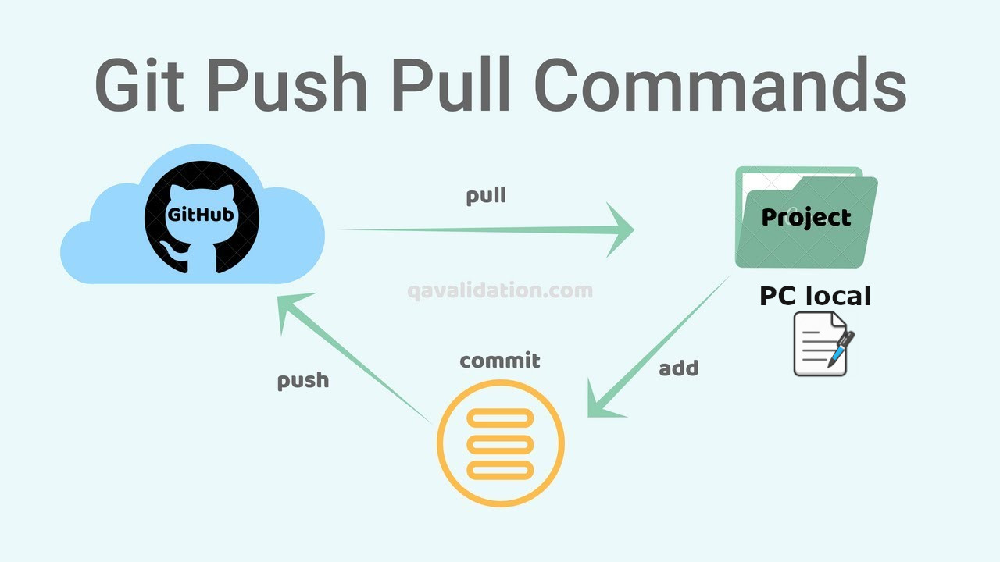

# Guía para configurar y usar Git con GitHub

## Requisitos previos

1. Instalar [XAMPP](https://www.apachefriends.org/es/index.html).
2. Instalar [Visual Studio Code](https://code.visualstudio.com/).
3. Instalar [Git](https://git-scm.com/).
4. Tener una cuenta en [GitHub](https://github.com/).

## Crear repositorio en GitHub

1. Ir a GitHub y crear un nuevo repositorio, puede ser público.

## Pasos para usar Git

### Verificar instalación.

Ejecutar git -v, si la salida del comando es un "not found" o no encontrado, significa que no esta instalado todavia. 
```bash
PS C:\Users\50688> git -v
git version 2.47.1.windows.2
```

### Configuración de usuario

Abrir una terminal y ejecutar los siguientes comandos para configurar tu nombre y correo electrónico:

```bash
git config --global user.name "Progra 3"
git config --global user.email "testpruebaprogra@gmail.com"
```

### Clonar el repositorio
**Usualmente esto se hace una vez.**

Navegar a la carpeta `htdocs` de XAMPP:

```bash
cd C:\xampp\htdocs
```

Clonar el repositorio que creaste en GitHub (se te pedirá que inicies sesión vía web):

```bash
git clone https://github.com/SU-REPOSITORIO/test-progra3.git
```

Luego, entrar al directorio del repositorio clonado:

```bash
cd test-progra3
```

### Abrir proyecto en Visual Studio Code

Abre la carpeta del proyecto con Visual Studio Code.

### Crear un archivo `index.php`

Dentro de Visual Studio Code, crea un archivo llamado `index.php` con el siguiente contenido:

```php
<?php
   echo "hola mundo";
?>
```

### Agregar los cambios al repositorio

Ejecuta el siguiente comando para agregar los cambios:

```bash
git add .
```

### Hacer commit de los cambios

Realiza el commit de los cambios con un mensaje descriptivo:

```bash
git commit -m "Añadí mi primer archivo"
```

### Enviar los cambios a GitHub

Sube los cambios a GitHub:

```bash
git push origin main
```
**NOTA:**
git push origin main significa que estás subiendo los cambios de la rama principal (main) de tu repositorio local al repositorio remoto llamado origin.

Revisa el repositorio en GitHub(WEB) para verificar que los cambios se hayan aplicado.

## Instalar GitHub Desktop

Descarga e instala [GitHub Desktop](https://desktop.github.com/).

## Crear una nueva rama

Para crear una nueva rama, usa el siguiente comando (la opción `-b` es importante):

```bash
git checkout -b NOMBRE-NUEVA-RAMA
```

Por ejemplo:

```bash
git checkout -b copia-mi-codigo
```

## Realizar un pull request

Después de hacer cambios en la nueva rama, realiza un pull request para fusionar los cambios en la rama principal (main).


## Flujo


